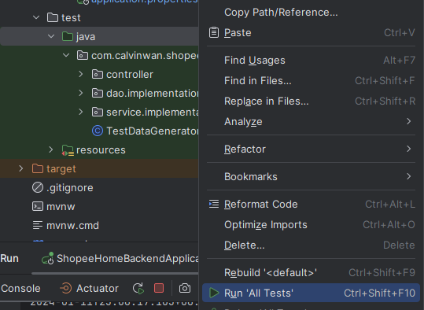

# ShopeeHome

## Introduction
Shopee home is a web application that allows users to shop online. It is a practice project provides a platform for users to register, login, view products, add products to the cart, and checkout. It also provides a platform for shop owners to register, login, add products, view orders, and view order details. The admin can view the user list, view the user detail, view the shop list, view the shop detail, remove the user, and remove the shop.

- Frontend
    - [shopeehome-frontend-shop](https://github.com/CalvinWan0101/ShopeeHome-frontend-shop)
    - [shopeehome-frontend-user](https://github.com/CalvinWan0101/ShopeeHome-frontend-user)
- Backend
    - [shopeehome-backend](https://github.com/CalvinWan0101/ShopeeHome-backend)
    - [API](https://docs.google.com/spreadsheets/d/1W-Uq1k9X8QTFEQBRANpnaXJV6QCcKX9wi-mXsyMchJ8/edit?usp=sharing)

### Features
| User Actions        | Shop Actions         | Admin Actions       |
|---------------------|----------------------|---------------------|
| Register            | Register             | Login               |
| Login               | Login                | Logout              |
| Logout              | Logout               | View user list      |
| View profile        | View profile         | View user detail    |
| Edit profile        | Edit profile         | View shop list      |
| View order history  | View product list    | View shop detail    |
| View order detail   | View product detail  | Remove user         |
| Add to cart         | Add product          | Remove shop         |
| Remove from cart    | Edit product         |                     |
| Checkout            | Remove product       |                     |
|                     | View order history   |                     |
|                     | View order detail    |                     |
|                     | View order list      |                     |
|                     | View order detail    |                     |

### Entity-Relationship (ER) Model

### Schema of the Database

### Functional Dependencies

## Usage

### Environment setup
1. install java 21 (https://www.oracle.com/tw/java/technologies/downloads/)
1. install intellij (https://www.jetbrains.com/idea/)
1. install git (https://www.git-scm.com/download/win)
1. install PostgreSQL (https://www.enterprisedb.com/downloads/postgres-postgresql-downloads)
1. Create a database named `shopeehome`
1. Set Environment Variables
    - POSTGRES_USERNAME= ${your postgresql username}
    - POSTGRES_PASSWORD = ${your postgresql password}

### Execution

1. Use intellij to open the folder (ShopeeHome-backend)
    - maven install
        
        
        
    - Set up the project structure to java 21
        
        
        
    - Connect to database
        
        
        
        
        
1. Find out the create.sql file and manually create the table
    

    
1. Run all tests to ensure the backend is working properly
    
    

    

    
1. Run TestDataGenerator to generate demo data
    
    
1. Execute the backend
    